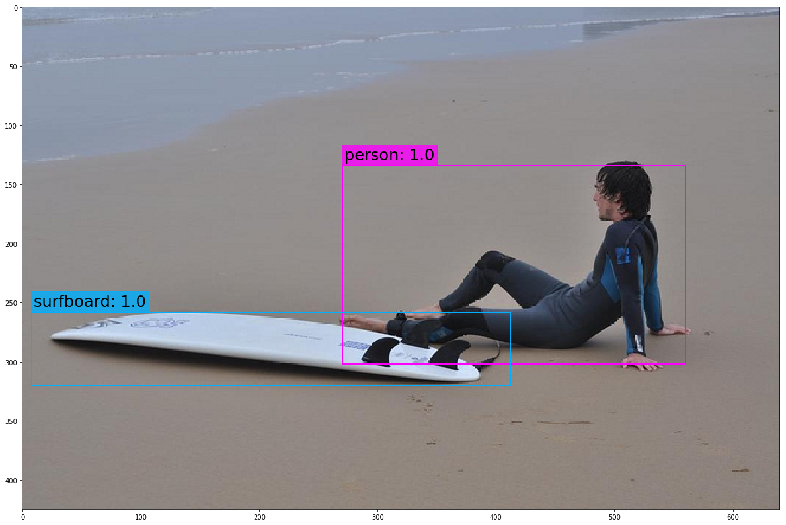

# YOLO-v3

YOLO is a state-of-the-art, real-time object detection algorithm. 

The utils module contains some helper functions, and a modified version of Darknet. YOLO uses Darknet, an open source, deep neural network framework written by the creators of YOLO. The version of Darknet used in here has been modified to work in PyTorch 0.4 and has been simplified because we won't be doing any training. Instead, we will be using a set of pre-trained weights that were trained on the Common Objects in Context (COCO) database.
